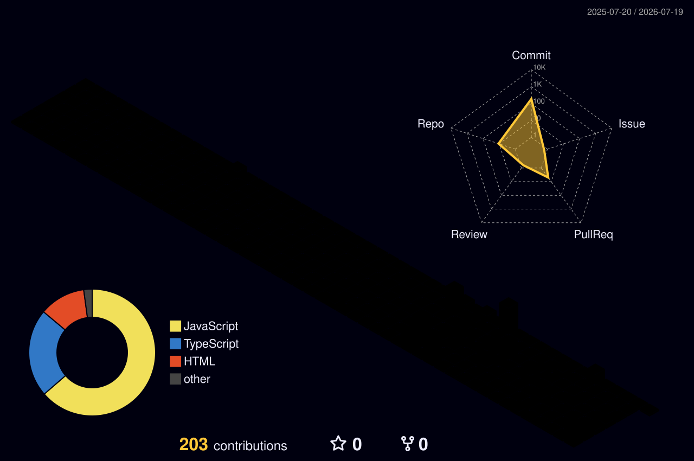

<div align="center">


</div>

<div align="center">

[](https://git.io/typing-svg)

</div>

---

<br/>

```javascript
const vishwath = {
  name     : "Vishwath Narayana",
  role     : "Full Stack Developer",
  passion  : "Building stunning UI & SaaS applications",
  frontend : ["React.js", "Next.js", "Shadcn UI"],
  backend  : ["Node.js", "Express.js"],
  database : ["MongoDB", "Supabase"],
  cloud    : ["Cloudinary"],
  currently: "Shipping SaaS products that look 🔥",
  motto    : "If the UI isn't stunning, it's not done."
};
```

<br/>

---

## ⚡ Tech Stack

<div align="center">

**Frontend**


**Backend & Database**


**Cloud & Tools**


</div>

---

## 📊 GitHub Stats

<div align="center">


</div>

---

## 🏆 Trophies

<div align="center">

[](https://github.com/ryo-ma/github-profile-trophy)

</div>

---

## 🌐 3D Contribution Graph

<div align="center">



</div>

---

## 🚀 Featured Projects

<div align="center">

[](https://github.com/Vishwath-Narayana/IDRS_STUDENT_FRONTEND)
[](https://github.com/Vishwath-Narayana/FileDrive)

[](https://github.com/Vishwath-Narayana/Drop2Donate)
[](https://github.com/Vishwath-Narayana/saas-payment-dashboard)

</div>

---

## 🤝 Connect

<div align="center">

[](https://linkedin.com/in/your-linkedin)
[](https://your-portfolio.com)
[](mailto:your@email.com)

<br/>


</div>

<br/>

<div align="center">


</div>
